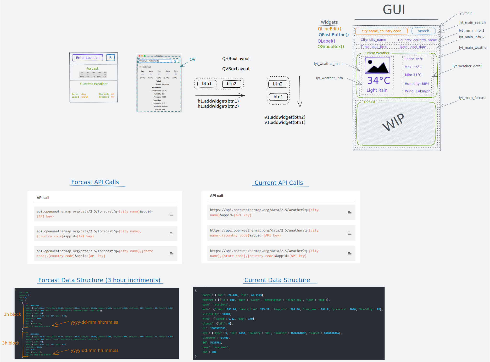

# Weather App
| Remote Image | Local Image |
|:------------:|:-----------:|
|  |  |

## Features
- Get weather, time and date info from "city name, country code" search input
- Weather Details
    - Weather Icon
    - Temp
    - Description
    - Feels Like
    - Max Temp
    - Min Temp
    - Humidity
    - Wind Speed

## Requirements
- openweathermap API Key
- requests
- PyQt6
- pathlib
- dotenv
- json
- os
- sys

